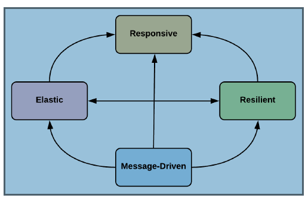
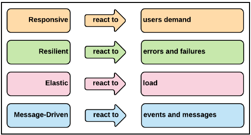
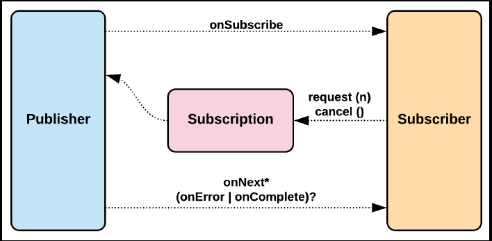

# Springboot-security and reactive programming

### Chương 1 Tổng quan về spring 5 và spring security 5

#### Những yêu cầu cho những ứng dụng mới.
1. Highly scalable : 
    - Những nền tảng phát triển mạnh mẽ trong suốt thập kỷ qua và con người ngày càng có những hiểu biết vê công nghệ hơn trước.
2. Resilient, fault-tolerant, and highly available :
    - Thời gian chết của ứng dụng là một trong những vấn đề mà các doanh nghiệp chưa thể thích nghi trong thời đại hiện này,
    thời gian chết chỉ vài giây  thôi nhưng nó có thể gây ra rât nhiều vấn đề lớn cho doanh nghiệp
3. High performance: 
    - Nếu ứng dụng của bạn chậm, thông thường mọi người sẽ có xu hứng rời bỏ và tìm kiếm một ứng dụng khác để thay thế.
4. Hyper-personalization:
    - Những người dùng cần 1 website mang tính cá nhân hơn là những website thông thường điều này tạo ra những thách thức
    về phía máy chủ để thực hiện nhiều phân tích cụ cụ thể trong thời gian thực.
#### Reactive programming.
 - Là một mô hình lập trình mà việc xử lý dữ liệu bất đồng bộ dưới dang stream. Luồng dữ liệu được xử lý theo từng phần thay đổi giống
 như là nhưng bản tin (messages). Các message này được tạo ra bởi thành phần gọi là Producer và làm việc push message theo thời gian.
 Subscriber là thành phần theo dõi sự thay đổi theo thời gian của các message như là lấy message, xử lý nó và chuyển message tới thành 
 phần cuối của hệ thống được gọi là Consummer.
 - Về mặt cơ sở dữ liệu, NoSQL là một sự chuyển dịch từ các cơ sở dữ liệu quan hệ. Tương tự như vậy , reactive programming
 là một sự chuyển dịch từ mô hình lập trình (imperative programming).
 #### Reactive applications. 
 - Giới thiệu qua về phần này, chúng ta sẽ điểm qua lại những dự thay đổi quan trọng của requirement của các hệ thống trong nhiều năm qua.
 Để có được điều này , đây là khái niệm của việc phát triển những ứng dụng được gọi là reactive applications.
 Điều này rất quan trọng để hiểu sự khác nhau giữa reactive programming và reactive applications. Việc sử dụng mô hình lập trình reative hông tạo
 ra các ứng dụng reactive, nhưng các khái niệm của mô hình lập trình reactive chắc chắn có thể xây dựng các ứng dụng reactive.
 #### Reactive Manifesto.
 - Reactive manifesto được gọi là quan điểm của các nhà phát triển rằng một ứng dụng có thể được phát triển theo mô hình reactive.
 Và theo như Reactive Manifesto (https://www.reactivemanifesto.org/) thì một reactive system nên là sẵn sàng đáp lại (responsive)
 , có khả năng phục hổi nhanh (resilient) , có tính mềm dẻo (elastic) và hướng message (message-driven).
 1. Responsive.
    - Responsive system được hiểu đơn giản là các hệ thông nhanh chống phát hiện và giải quyết hiệu quả các vấn đề. Các hệ thống này
    cũng cho thời gian phản hồi nhất quan và cũng thiết lập các giới hạn, đảm bảo chỉ số QoS tối thiểu. Do những tính chất trên
    các hệ thống này xây dựng tính bảo mật đối với các end users, đơn giản trong xử lý lỗi và khuyến khích nhiều hơn các tương tác từ phía người dùng cuối
 2. Resilient.
    - Trong các trường hợp lỗi, resilient systems dữ nguyên các tương tác và các phản hồi. Tính Resilience trong 1 ứng dụng có thể đạt được nhờ cá
    tiêu chí sau:
        - Replication: 1 component có thể hoạt động ở nhiều hơn 1 nơi(có thể tạo ra nhiều instances cùng hoạt đồng). Nếu một instance lỗi,
        thì ứng dụng vẫn có thể hoạt động bình thường.
        - Containment/isolation: Các vấn đề của một conponent cụ thể được đóng gói và tách biệt chỉ trong component đó và không gây trở ngại tới
        các component khác hoặc các components trong cùng 1 replication.
        - Delegation: Trong trường hợp gặp issue tại 1 component, nếu không có ảnh hưởng lớn thì việc chuyển giao việc thực hiện
        tới một component tương tự khác đang hoạt động tại một phạm vi hoàn toàn khác.
 3. Elastic.
    - Elastic systems có thể dễ dàng tự động scale khi đầu vào ra tăng hoặc giảm mà ko có bất kỳ sự xáo trộn nào trong hệ thống
    , hệ thống có thể tạo ra các bản sao của một component phân chia tải khi gia tăng. Theo cách này thì hệ thống được thiết kế
    để đảm bảo rằng việc scaling theo yêu cầu, nó có thể được hoàn thành vs chi phí thấp bằng việc thêm phần cứng hoặc các phần mềm ngược lại 
    với việc mua licensed của các phần mềm.
 4. Message-driven.
    - Trong các reactive applications, một khía cạnh quan trọng là việc sự dụng các messages bất đồng bộ để truyển tải dữ liệu giữa các component.
    Điều này mang lại tính Loose coupling giữa các thành phần trong hệ thống.
    Việc tạo ra các messages push message, các subscriber đăng ký để nhận các message, xử lý nó rồi gửi các message này tới các subscibe khác để thử 
    hiện các công việc khác. Đây chính là các khái niệm cốt lõi của mô hình lập trình reactive và là các khái niệm cơ bản của một reactive system.
      
      
    
      
    Hình trên là mối quan hệ giữa các khái niệm trong Reactive Manifesto:
#### Tổng quan Spring framework.
=> phần này tự đọc.
#### Bối cảnh reactive trong Java.
#### Reactive Streams and Reactive Streams Specifications
 - Tài liệu chính thức từ trang chủ dành cho Reactive Stream: 
 _Reactive Streams is an initiative to provide a standard for asynchronous stream processing
 with non-blocking back pressure. This encompasses efforts aimed at runtime environments (JVM and
 JavaScript) as well as network protocols_
 - Nó được bắt đầu vào một nhóm của các cty vào năm 2013. Vào 2015 thì phiên phản 1.0 được phát hành, nó bao gồm một tập các
 implementations (như là Akka streams và Vert.x) được công bố vào cùng một thời điểm. Đặc tả này được bắt đầu và bao gồm thư viện
 tại trang chủ của Java và vào 2017 thì JDK9 được phát hành. Qua thời gian thì reactive specification bao gồm một vài core interfaces
 , một vài rules xung quanh những interface này và TCK (Technology Compatibility Kit).
 TCK là mộ bộ các test case được thự hiện kiểm tra tính đúng đắc của một JSR (**Java Specification Request**) implementation.
 TCK là một trong ba các thành phần bắt buộc dành cho việc phê chuẩn một JSR. Thành phần thứ 2 là JSR specification 
 và JSR reference implementation. TCK dành cho Java platform được gọi là Java Compatibility Kit(JCK).
 - Việc trở thành một specification, nó cho phép bất kỳ implementation nào tôn trọng đặc tả và có liên kế với nhau.
 Ví dụ Akka có thể cùng làm việc với Vert.x thông qua đặc tả của Reactive Stream. Chính vì vậy đặt tả này được implementation
 dưới các ngôn ngữ khác nhau đang được phát hành.
 
 Hình trên là thể hiện toàn bộ đặc tả của reactive streams. Bao gồm một vài rules và các thành phần sau:
    1. Giao tiếp giữa Publisher và Subscriber và ngược lại thì ko nên đồng bộ.
    2. Subscriber có thể thực hiện các công việc đồng bộ hoặc bất đồng bộ nhưng luôn luôn phải là non-blocking.
    3. Cả publisher và subscriber cần phải đặt ra một giới hạn trên về xử lý của riêng mình, sau khi thiết lập giới hạn này
    có thể việc tràn bộ đệm sẽ xảy ra và có thể xuất hiện lỗi.
    
