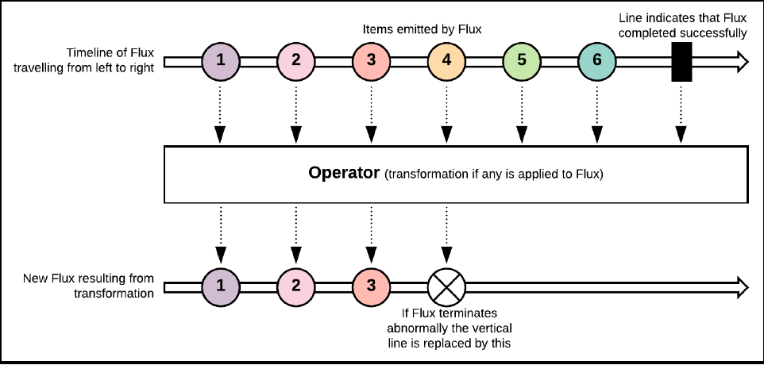
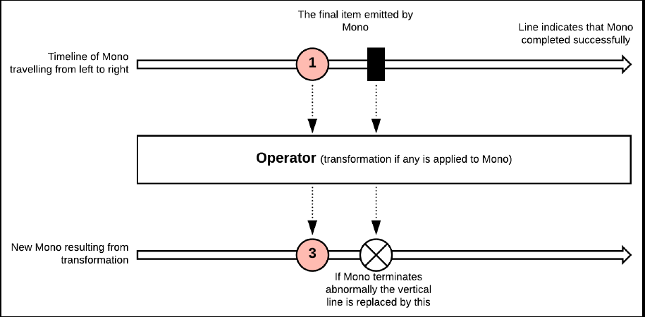
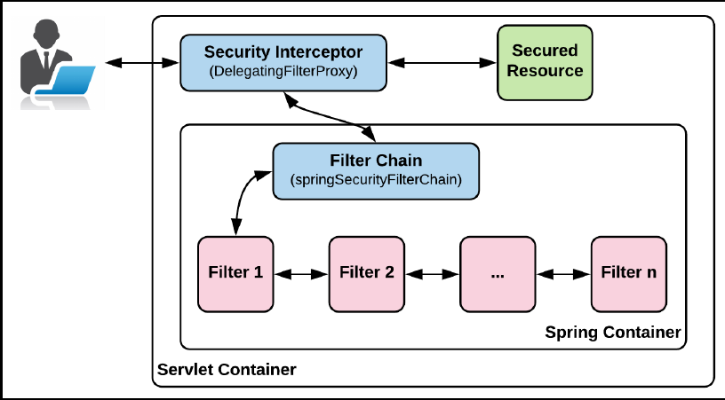

# Springboot-security and reactive programming

### Chương 1 Tổng quan về spring 5 và spring security 5

#### Những yêu cầu cho những ứng dụng mới.
1. Highly scalable : 
    - Những nền tảng phát triển mạnh mẽ trong suốt thập kỷ qua và con người ngày càng có những hiểu biết vê công nghệ hơn trước.
2. Resilient, fault-tolerant, and highly available :
    - Thời gian chết của ứng dụng là một trong những vấn đề mà các doanh nghiệp chưa thể thích nghi trong thời đại hiện này,
    thời gian chết chỉ vài giây  thôi nhưng nó có thể gây ra rât nhiều vấn đề lớn cho doanh nghiệp
3. High performance: 
    - Nếu ứng dụng của bạn chậm, thông thường mọi người sẽ có xu hứng rời bỏ và tìm kiếm một ứng dụng khác để thay thế.
4. Hyper-personalization:
    - Những người dùng cần 1 website mang tính cá nhân hơn là những website thông thường điều này tạo ra những thách thức
    về phía máy chủ để thực hiện nhiều phân tích cụ cụ thể trong thời gian thực.
#### Reactive programming.
 - Là một mô hình lập trình mà việc xử lý dữ liệu bất đồng bộ dưới dang stream. Luồng dữ liệu được xử lý theo từng phần thay đổi giống
 như là nhưng bản tin (messages). Các message này được tạo ra bởi thành phần gọi là Producer và làm việc push message theo thời gian.
 Subscriber là thành phần theo dõi sự thay đổi theo thời gian của các message như là lấy message, xử lý nó và chuyển message tới thành 
 phần cuối của hệ thống được gọi là Consummer.
 - Về mặt cơ sở dữ liệu, NoSQL là một sự chuyển dịch từ các cơ sở dữ liệu quan hệ. Tương tự như vậy , reactive programming
 là một sự chuyển dịch từ mô hình lập trình (imperative programming).
 #### Reactive applications. 
 - Giới thiệu qua về phần này, chúng ta sẽ điểm qua lại những dự thay đổi quan trọng của requirement của các hệ thống trong nhiều năm qua.
 Để có được điều này , đây là khái niệm của việc phát triển những ứng dụng được gọi là reactive applications.
 Điều này rất quan trọng để hiểu sự khác nhau giữa reactive programming và reactive applications. Việc sử dụng mô hình lập trình reative hông tạo
 ra các ứng dụng reactive, nhưng các khái niệm của mô hình lập trình reactive chắc chắn có thể xây dựng các ứng dụng reactive.
 #### Reactive Manifesto.
 - Reactive manifesto được gọi là quan điểm của các nhà phát triển rằng một ứng dụng có thể được phát triển theo mô hình reactive.
 Và theo như Reactive Manifesto (https://www.reactivemanifesto.org/) thì một reactive system nên là sẵn sàng đáp lại (responsive)
 , có khả năng phục hổi nhanh (resilient) , có tính mềm dẻo (elastic) và hướng message (message-driven).
 1. Responsive.
    - Responsive system được hiểu đơn giản là các hệ thông nhanh chống phát hiện và giải quyết hiệu quả các vấn đề. Các hệ thống này
    cũng cho thời gian phản hồi nhất quan và cũng thiết lập các giới hạn, đảm bảo chỉ số QoS tối thiểu. Do những tính chất trên
    các hệ thống này xây dựng tính bảo mật đối với các end users, đơn giản trong xử lý lỗi và khuyến khích nhiều hơn các tương tác từ phía người dùng cuối
 2. Resilient.
    - Trong các trường hợp lỗi, resilient systems dữ nguyên các tương tác và các phản hồi. Tính Resilience trong 1 ứng dụng có thể đạt được nhờ cá
    tiêu chí sau:
        - Replication: 1 component có thể hoạt động ở nhiều hơn 1 nơi(có thể tạo ra nhiều instances cùng hoạt đồng). Nếu một instance lỗi,
        thì ứng dụng vẫn có thể hoạt động bình thường.
        - Containment/isolation: Các vấn đề của một conponent cụ thể được đóng gói và tách biệt chỉ trong component đó và không gây trở ngại tới
        các component khác hoặc các components trong cùng 1 replication.
        - Delegation: Trong trường hợp gặp issue tại 1 component, nếu không có ảnh hưởng lớn thì việc chuyển giao việc thực hiện
        tới một component tương tự khác đang hoạt động tại một phạm vi hoàn toàn khác.
 3. Elastic.
    - Elastic systems có thể dễ dàng tự động scale khi đầu vào ra tăng hoặc giảm mà ko có bất kỳ sự xáo trộn nào trong hệ thống
    , hệ thống có thể tạo ra các bản sao của một component phân chia tải khi gia tăng. Theo cách này thì hệ thống được thiết kế
    để đảm bảo rằng việc scaling theo yêu cầu, nó có thể được hoàn thành vs chi phí thấp bằng việc thêm phần cứng hoặc các phần mềm ngược lại 
    với việc mua licensed của các phần mềm.
 4. Message-driven.
    - Trong các reactive applications, một khía cạnh quan trọng là việc sự dụng các messages bất đồng bộ để truyển tải dữ liệu giữa các component.
    Điều này mang lại tính Loose coupling giữa các thành phần trong hệ thống.
    Việc tạo ra các messages push message, các subscriber đăng ký để nhận các message, xử lý nó rồi gửi các message này tới các subscibe khác để thử 
    hiện các công việc khác. Đây chính là các khái niệm cốt lõi của mô hình lập trình reactive và là các khái niệm cơ bản của một reactive system.
      
      
    
      
    Hình trên là mối quan hệ giữa các khái niệm trong Reactive Manifesto:
#### Tổng quan Spring framework.
=> phần này tự đọc.
#### Bối cảnh reactive trong Java.
#### Reactive Streams and Reactive Streams Specifications
 - Tài liệu chính thức từ trang chủ dành cho Reactive Stream: 
 _Reactive Streams is an initiative to provide a standard for asynchronous stream processing
 with non-blocking back pressure. This encompasses efforts aimed at runtime environments (JVM and
 JavaScript) as well as network protocols_
 - Nó được bắt đầu vào một nhóm của các cty vào năm 2013. Vào 2015 thì phiên phản 1.0 được phát hành, nó bao gồm một tập các
 implementations (như là Akka streams và Vert.x) được công bố vào cùng một thời điểm. Đặc tả này được bắt đầu và bao gồm thư viện
 tại trang chủ của Java và vào 2017 thì JDK9 được phát hành. Qua thời gian thì reactive specification bao gồm một vài core interfaces
 , một vài rules xung quanh những interface này và TCK (Technology Compatibility Kit).
 TCK là mộ bộ các test case được thự hiện kiểm tra tính đúng đắc của một JSR (**Java Specification Request**) implementation.
 TCK là một trong ba các thành phần bắt buộc dành cho việc phê chuẩn một JSR. Thành phần thứ 2 là JSR specification 
 và JSR reference implementation. TCK dành cho Java platform được gọi là Java Compatibility Kit(JCK).
 - Việc trở thành một specification, nó cho phép bất kỳ implementation nào tôn trọng đặc tả và có liên kế với nhau.
 Ví dụ Akka có thể cùng làm việc với Vert.x thông qua đặc tả của Reactive Stream. Chính vì vậy đặt tả này được implementation
 dưới các ngôn ngữ khác nhau đang được phát hành.
 
 Hình trên là thể hiện toàn bộ đặc tả của reactive streams. Bao gồm một vài rules và các thành phần sau:
    1. Giao tiếp giữa Publisher và Subscriber và ngược lại thì ko nên đồng bộ.
    2. Subscriber có thể thực hiện các công việc đồng bộ hoặc bất đồng bộ nhưng luôn luôn phải là non-blocking.
    3. Cả publisher và subscriber cần phải đặt ra một giới hạn trên về xử lý của riêng mình, sau khi thiết lập giới hạn này
    có thể việc tràn bộ đệm sẽ xảy ra và có thể xuất hiện lỗi.
    4. Trong trường hợp có Null Pointer Exception (NPE) (chỉ NPE thôi) thì Publisher sẽ gọi một hàm **onError** và Subscriber hủy bỏ **Subscription**
Hai khái niệm rất quan trọng của reactive stream đó là **non-blocking** và **backpressure**.
    - Non-blocking: các threads ko bao giờ bị block, nếu thread bị lock thì cần phải có thông báo đúng thời điểm và quá
    trình vẫn có thể tiếp tục xảy ra. Việc xây dựng lên các ứng dụng non-blocking sẽ sử dụng message để gửi data. Các thread sẽ gửi message
    và nhận lại ngay khi có phản hồi , tiếp tục gửi tới các thread khác để xử lý các task vụ khác. Khái niệm Non-blocking này 
    cũng được implemented bởi các frameworks như Node.js và Akka.
    - Backpressure: Theo kịch bản lý tưởng, mọi message được tạo ra từ producer và gửi tới subscriber mà ko có delay.
    nhưng trên thực tế thì subscriber không thể handle các message vào cùng một thời điểm khi chúng được gửi tới.
    Chính vì vậy Backpressure là một cách thức mà subscriber nói cho producer biết gửi message và một tốc độ chậm tới
    subscriber  để có thể xử lý các message này một các hợp lý mà ko cần phải gây ra quá nhiều áp lực tới resources.
#### Reactive Extensions
 - Là một thư viên dành cho các chương trình xử lý bất đồng bộ và event-based sử dụng các chuỗi tuần tự có thể quan sát theo thời gian
 và các toán tử query LINQ-style. Các chuỗi dữ liệu tuần tự có thể mang nhiều định dạng khác nhau như là dưới dạng stream, file hoặc web service,
 system notifications hoặc chuỗi các events từ người dùng.
 - Những API cho phép xử lý các tổ hớp các stream data sử dụng Observer pattern.
 - Observer pattern: định nghĩa một provider(được hiểu là một subject hoặc 1 observable) và gồm nhiều 0 hoặc 1 hoặc nhiều observers.
  Các Observers đăng ký với provider và bất kỳ khi nào một điều kiện được xác định , một sự kiện, hoặc sự thay đổi trạng thái thay đổi
  provider tự động thông báo tới các observers bắng cách gọi một trong các phương thức của các observers đó. 
#### RxJava.
 - Là một Java VM implementation của ReactiveX. một thư viên nhỏ tập trung vào lớp abstract của observable. Nó dễ dàng
 tích hợp và các thư viện khác như rxjava-jdbc, Camel RX.
#### Reactive Streams và RxJava.
 - RxJava 2.x là một phiên bản hoàn chỉnh  của RxJava 1.x, nó sử dụng Java8+.
 - Những interface quan trọng trong reactive stream specifications.
    + Publisher
    + Subscriber
    + Subscription
    + Processor: Kế thừa cả từ Publisher và Subscriber
#### Spring Framework and reactive applications.
- Sử dụng Reactor là một implementing của Reactive Stream Specification, là thế hệ thứ 4 của thư viện reactive dành cho
việc xây dựng các ứng dụng non-blocking trên nền máy ảo dựa vào reactive stream specification.
- Các modules trong reactor tại phiên bản mới nhất là Reactor 3.x:
    + Reactor Core: Thư viện chính trong Reactor, cung cấp việc implementation non-blocking JVM RSS (reactive stream specification)
    Nó cũng bao gồm 2 kiểu dữ liệu trong reactor là Flux và Mono.
    + Reactor IO: Bao gồm các backpressure-ready components có thể được sử dụng để encode, decode.. và phục vụ các connections.
    Nó cũng support Kafka, Netty và Aeron.
    + Addons: bao gồm 3 components:
        + reactor-adapter: Bao gồm 1 cầu nối từ RxJava 1 or 2 kiểu giống như là Observable, Completable, Single, Maybe and 
        Mono/Flux
        + reactor-logback: Hỗ trợ ghi log thông qua các bộ xử lý bất đồng bộ reactor core.
        + reactor-extra: Bao gồm nhiều operations dành cho Flux nhưng là các xử lý toàn học ..
    + Reactive Stream Commons: là việc tổ hợp giữa Reactor vs RxJava.
#### Reactive types in reactor core.
- Reactor cung cấp 2 kiểu dữ liễu là Flux và Mono , chúng thể hiện sự thay đổi dự liệu theo thời gian. Điều quan trọng nhất
là sử dụng kiểu dữ liệu nào cho phù hợp.
- Flux:
    - Là một publisher có các operators có thể tạo ra 0 tới N elements và hoàn thành.  
    
      Hình trên mô tả cách hoạt động của Flux.
    - Có nhiều cách tạo ra 1 Flux.
    (tham khảo các API https://projectreactor. io/docs/core/release/api/reactor/core/publisher/Flux.html.)
- Mono:
    - Là một publisher có các operators chỉ có thể tạo ra 1 element hoặc 1 lỗi.  
      
      Hình trên mô tả cách hoạt động của Mono.  
     Mono<Void> hay sử dụng trong trường hợp hoàn thành mà ko cần phải return về giá trị nào cả. 
     Có rất nhiều cách tạo ra một Mono tham khảo API.
#### Data stream types
- Được phân thành 2 loại.
    + Cold data stream: bao gồm Cold Source, Cold Observable và Cold Publisher. Chúng emit dữ liệu chỉ khi có một 
    subscriber tới và chính vì điều này tất cả các message được tạo ra từ khi bắt đầu được gửi thẳng tới subsciber. 
    Nếu một subsciber mới kết nối tới một publisher, các message được gửi lại theo thứ tự tăng dần và điều này được 
    thực hiện đối với tất cả các Subsciber mới.
    Subscriber cũng có một bộ dự phòng để thông báo về tốc độ khi nào Publisher nên emit message.
    + Hot data stream: nó có thể được gọi là Hot Source, Hot Observable và Hot Publisher. tức là data được emit bất cứ 
    lúc nào khi subscribed đã kết nối. Khi một subscriber mới kết nối thì emit message từ thời điểm tạo ra, ko tạo lại message
    từ thời điểm bắt đầu. Nó không thể dừng việc emit message do vậy một kỹ thuật thay đổi là cần thiết để điều khiển
    flow data như là buffer. Ví dụ của stream loại này là Mouse events và giá của chứng khoán.
Điều quan trọng nhất là các operators xử lý trên 1 stream có thể thay đổi đặc tính của chúng, từ cold tới hot và ngược lại.
Cũng có khi là có thể merge giữ hot và cold có thể xảy ra và các đặc tính của stream được thay đổi.

#### Reactive Web Application
##### Spring WebFlux.
- Sử dụng để xây dựng các web applications trên top của reactive streams, có khả năng chạy non-blocking server như Netty, Undertow,
và Servlet containers greater than 3.1.
- Yêu cầu Reactor là một trong những phần core, nhưng nó cho phép chúng ta chuyển sang 1 implementations khác một cách dễ
dàng nếu cần.

##### Reactive Spring Web.
The Spring Web Modules có nhiều phần để xây dựng các ứng dụng web reactive. Cho phép chúng ta thao tác giữa client và server.
Những tính năng này nó cung cấp phía server được phân chia làm 2:  
    + HTTP: bao gồm các APIs dành cho xử lý các HTTP request đối với các server được support  
    + Web: bao gồm các APIs dành cho xử lý request.
    
##### WebClient.
- Là một reactive web client sử dụng để thực hiện gửi các web requets.
##### WebSockets.
- Cho phép chúng ta thiết lập connection 2 chiều giữa client và server.
##### Application security.
##### Spring security.
 - Các thành phần của spring security:
    + Principal: bất kỳ đối tượng nào (user, device, system) muốn tương tác và ứng dụng của bạn.
    + Authentication: Là một xử lý để ứng dụng của bạn biết chắc chắn principal là ai.
    + Credentials: là object sau khi ứng dụng xác thực thành công một Principal.
    + Authorization: Sau khi authen thành công, principal sẽ được  kiểm tra các action có thể được thao tác vs ứng dụng
    , xử lý này sẽ kiểm tra và gán cho principal nhưng quyền cần thiết.
    + Secured item/resource: là tài nguyên của ứng dụng được bảo vệ. chỉ được truy cập khi authen và author được hoàn thành.
    + GrantedAuthority: là một interface bao gồm nắm giữ các permission, quyền truy cập chi tiết của một principal.
    + SecurityContext: là Object dùng để lưu trữ một principal đã được authenticated.
    
###### Spring security core feature.
- Authentication: 
- Authorization: 
    + Phân quyền qua URL
    + Phân quyền qua method.
    + Phần quyền qua Domain
    + Phân quyền bằng web service.
###### Spring Security 5's new features.
- Các tính năng mới trong spring 5.
    + Support dành cho OAuth 2.0 và OpenID connect(OIDC) 1.0: cho phép user login vào ứng dựng thông qua github hoặc thông qua
     google sử dụng OIDC. 
    + Support Reactive:
    + Cải tiến việc mã hóa password: Sử dụng nhiều hơn 1 thuật toán mã hóa. Spring nhận ra thuật toán bằng cách đọc prefix
     của đoạn mã hóa được endcode (nó sẽ bao gồm thuật toán sử dụng vs format như sau ({algorithm}endcode_passwod)
###### Working of Spring Security
 + Servlet Filter.
 + Filter Chain.
 + Security Interceptor (DelegatingFilterProxy)  
Hình dưới là mô tả spring security làm việc.  
 
  

###### Core Spring Security modules

#### Link tham khảo
https://dev.to/bufferings/springboot2-blocking-web-vs-reactive-web-46jn
    

    
    
